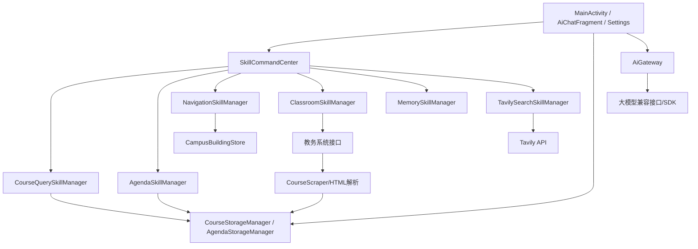
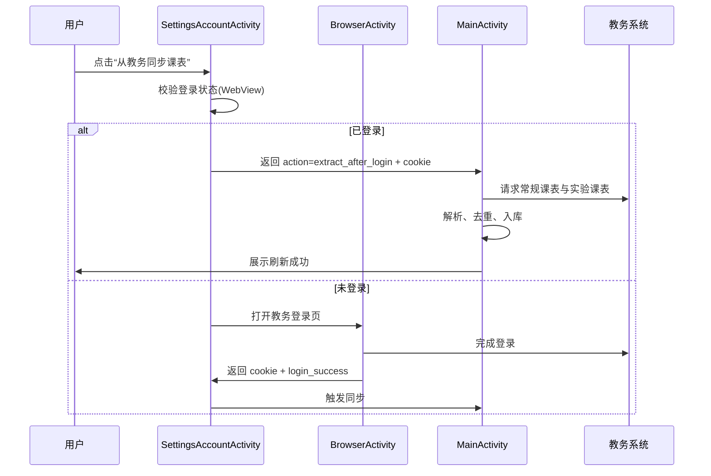
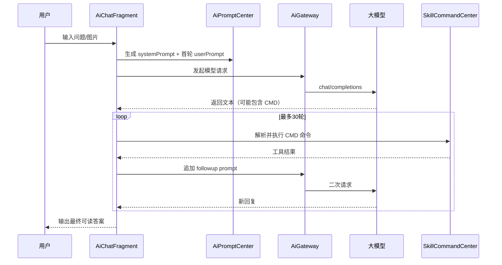

# HUTCourse 开发文档

## 1. 文档信息

- 项目名称：HUTCourse（智航校园 · HUTCourse AI Companion）
- 文档类型：开发文档（提交材料）
- 版本：v1.0
- 文档日期：2026-04-27
- 适用代码分支：当前工作区主线代码

---

## 2. 项目概述

HUTCourse 是一款面向湖南工业大学学生的 Android 原生应用，核心能力围绕“课程管理 + AI 助手 + 校园场景工具”展开。

项目目标：

1. 将课表查询、日程管理、空教室查询、校内导航、天气获取、记忆记录等高频校园操作集中到一个入口。
2. 通过大模型工具调用机制，将自然语言请求自动分解为可执行命令，实现“问一句就能办”。
3. 采用本地持久化与离线可读策略，保障弱网场景下的基本可用性。

---

## 3. 技术栈与版本基线

### 3.1 客户端与构建

- 平台：Android
- 语言：Java（Source/Target 21）
- 构建系统：Gradle Wrapper
- Android Gradle Plugin：9.1.1
- compileSdk：35
- minSdk：26
- targetSdk：35

### 3.2 关键依赖

- AndroidX AppCompat：1.6.1
- Material Components：1.10.0
- RecyclerView：1.3.2
- Jsoup：1.16.1（HTML 解析）
- openai-gpt3-java service：0.18.2（SDK 通道）
- Markwon：4.6.2（Markdown 渲染）

### 3.3 外部系统与服务

- HUT 教务系统（强智）：课表、空教室等信息源
- 大模型兼容接口：通过 `AiGateway` 调用
- Tavily（可选）：联网检索
- 高德地图 App（可选）：外部导航拉起

---

## 4. 总体架构设计

### 4.1 分层说明

系统采用“界面层 + 业务技能层 + 数据层 + 外部接入层”的分层组织，核心职责如下：

1. 界面层（Activity / Fragment）
   - 负责用户交互、页面状态切换、表单输入与展示。
2. 业务技能层（Skill Manager）
   - 负责将自然语言意图映射为结构化能力调用。
3. 数据层（Storage / SQLite / SharedPreferences）
   - 负责课程、日程、位置等本地数据持久化与查询。
4. 外部接入层（AI / 教务 / 天气 / 地图）
   - 负责 HTTP 请求、Cookie 会话、第三方服务交互。

### 4.2 关键组件

- 主入口：`MainActivity`
- AI 对话：`AiChatActivity` + `AiChatFragment`
- 技能调度：`SkillCommandCenter`
- 提示词中心：`AiPromptCenter`
- 模型网关：`AiGateway`
- 课表抓取：`CourseScraper`
- 日程技能：`AgendaSkillManager`
- 导航技能：`NavigationSkillManager`
- 空教室技能：`ClassroomSkillManager`
- 联网搜索技能：`TavilySearchSkillManager`
- 数据管理：`CourseStorageManager` / `AgendaStorageManager` / `CampusBuildingStore`

### 4.3 架构关系图（逻辑）



---

## 5. 核心功能模块设计

## 5.1 课表同步与展示

### 功能点

1. 教务登录状态检测与 Cookie 会话复用。
2. 常规课表 + 实验课表双源抓取。
3. HTML 表格解析、周次解析、去重合并。
4. 本地存储后在周视图网格中渲染。

### 实现要点

1. 从教务系统页面抓取 HTML，采用 Jsoup 解析节点。
2. 同步流程内置“静默重试登录”策略，减少登录失效影响。
3. 使用 `deduplicate` 按课程关键键合并周次，避免重复显示。
4. 课表数据同时写入 SharedPreferences JSON 与 SQLite，保证读写鲁棒性。

## 5.2 AI 助手与工具调用

### 功能点

1. 文本对话与图文混合输入（最多 4 张图）。
2. 会话历史管理与模型切换。
3. 基于 `CMD:` 协议的多轮工具调用（上限 30 轮）。
4. 工具执行回执聚合与系统卡片交互（登录、导航、配置）。

### 设计要点

1. `AiPromptCenter` 负责系统提示词与轮次跟进提示构造。
2. `SkillCommandCenter` 负责命令抽取、权限开关校验、命令分发。
3. `AiGateway` 同时支持 SDK 模式和 OpenAI 兼容 HTTP 模式。
4. 支持请求缓存提示字段（conversationId、promptCacheKey）降低重复上下文开销。

## 5.3 日程管理

### 功能点

1. CRUD：新增、编辑、删除、查询、搜索。
2. 重复规则：不重复 / 每天 / 每周 / 每月固定日。
3. 每月短月策略：跳过 / 改到月底。
4. 手动新增与 AI 生成双入口。

### 实现要点

1. `AgendaStorageManager` 实现“某日是否发生”统一判定。
2. 时间以分钟值存储，避免字符串比较误差。
3. 日程可与课表共同渲染在周网格中，支持冲突合并显示。

## 5.4 校园导航与定位

### 功能点

1. 校园楼栋检索与别名匹配。
2. 用户位置语义化输出（楼内/附近/两楼之间）。
3. 路线距离与步行时间估算。
4. 高德导航卡片拉起。

### 实现要点

1. `CampusBuildingStore` 内置楼栋与别名种子数据并存储到 SQLite。
2. 位置更新采用平滑抑抖策略，减少 GPS 波动。
3. 支持定位权限缺失时的降级提示。

## 5.5 空教室查询

### 功能点

1. 按日期、星期、时间段/节次查询空教室。
2. 查询指定公共教室今日使用情况。
3. 登录失效自动返回可恢复提示。

### 实现要点

1. 固定河西校区参数（`xqbh=2`）。
2. 支持 JSON 返回解析与 HTML 回退解析双路径。
3. 仅返回公共教室，结果数量受控（最多 10 条）。

## 5.6 系统设置与数据管理

### 功能点

1. 账号与教务同步：登录、课表刷新、清空、退出。
2. 显示设置：网格线、主题色、字体比例、课程颜色/信息编辑。
3. 数据管理：课表与 Cookie 导入导出（剪贴板）。
4. AI 设置：模型配置、技能开关、Tavily 配置。

---

## 6. 关键业务流程

## 6.1 教务同步流程



## 6.2 AI 工具调用流程



---

## 7. 数据模型设计

## 7.1 Course（课程）

| 字段 | 类型 | 说明 |
|---|---|---|
| name | String | 课程名 |
| teacher | String | 任课教师 |
| location | String | 上课地点 |
| dayOfWeek | int | 周一=1 至 周日=7 |
| startSection | int | 起始小节（如 1/3/5/7/9） |
| sectionSpan | int | 跨节长度 |
| timeStr | String | 原始时间文本 |
| weeks | List<Integer> | 周次列表 |
| typeClass | String | 课程分类标识 |
| isExperimental | boolean | 是否实验课 |
| isRemark | boolean | 是否备注课程 |

## 7.2 Agenda（日程）

| 字段 | 类型 | 说明 |
|---|---|---|
| id | long | 主键 |
| title | String | 标题 |
| description | String | 描述 |
| location | String | 地点 |
| date | String | 基准日期 yyyy-MM-dd |
| startMinute | int | 开始分钟 |
| endMinute | int | 结束分钟 |
| priority | int | 1低/2中/3高 |
| renderColor | int | 渲染颜色 |
| repeatRule | String | none/daily/weekly/monthly |
| monthlyStrategy | String | skip/month_end |
| createdAt | long | 创建时间 |
| updatedAt | long | 更新时间 |

---

## 8. 本地存储与配置

## 8.1 SharedPreferences

1. `course_storage`
   - 课表 JSON、学期起始日期、部分用户信息与课表展示配置。
2. `course_colors`
   - 课程颜色自定义映射。
3. `ai_config`
   - 多模型配置、技能开关、默认模型信息。
4. `tavily_config`
   - Tavily API Key 与 Base URL。
5. `ai_chat_history`
   - AI 多会话历史记录。
6. `tianyuan_weather`
   - 天气缓存与更新时间。

## 8.2 SQLite

1. `course_store.db` / `courses`
   - 课程持久化备份。
2. `agenda_store.db` / `agendas`
   - 日程持久化与重复规则存储。
3. `campus_geo.db`
   - `campus_building`：楼栋坐标。
   - `campus_building_alias`：别名映射。

## 8.3 文件存储

1. `files/skills/memory_user.md`：用户长期记忆。
2. `files/ai_chat_images/`：聊天上传图片压缩副本。

---

## 9. 权限、安全与合规

## 9.1 权限说明

1. `INTERNET`：访问模型、教务、天气、联网搜索。
2. `ACCESS_COARSE_LOCATION` / `ACCESS_FINE_LOCATION`：校内定位与距离估算。

## 9.2 安全策略（当前实现）

1. API Key 与模型配置保存在本地 SharedPreferences。
2. 教务 Cookie 由系统 `CookieManager` 管理。
3. 命令调用通过技能白名单与开关控制，避免越权工具执行。

## 9.3 风险与改进建议

1. 当前配置（API Key/Cookie）为本地明文存储，建议后续接入 Android Keystore。
2. 对外 HTTP 依赖网络环境，建议后续增加请求签名与重放保护策略。

---

## 10. 构建与运行指南

## 10.1 环境准备

1. JDK 21。
2. Android SDK（compileSdk 35）。
3. 可用网络（首次拉取依赖、访问教务与模型）。

## 10.2 命令（Windows）

```bash
gradlew.bat clean
gradlew.bat assembleDebug
```

## 10.3 产物

Debug APK 生成目录：

- `app/build/outputs/apk/debug/`

---

## 11. 测试与验收建议

## 11.1 功能回归清单

1. 教务登录后课表刷新与周次显示是否正确。
2. 今日页课程、天气、日程摘要是否联动更新。
3. AI 对话是否可执行课表/日程/导航/空教室工具调用。
4. 日程重复规则（每天/每周/每月）是否按预期触发。
5. 导航与定位在权限关闭/开启场景下是否提示合理。
6. 数据导入导出与重新打开应用后的持久化一致性。

## 11.2 边界场景

1. 教务登录失效时，AI 是否弹出登录卡片并支持续跑。
2. 无网络时是否有可理解的失败提示。
3. 未配置模型或 API Key 时是否正确引导到设置页。

---

## 12. 已知限制与后续规划

## 12.1 已知限制

1. 课表抓取依赖教务 HTML 结构稳定性，页面改版会影响解析。
2. 联网搜索默认关闭，需要手动配置 Tavily Key。
3. 当前无自动化单元测试与 UI 自动化测试覆盖。

## 12.2 后续规划

1. 增加自动化测试与 CI 构建校验。
2. 接入敏感数据安全存储（Keystore）。
3. 扩展校园能力（图书馆座位、考试安排、成绩分析等）。

---

## 13. 提交材料建议附录

建议提交时配套以下材料：

1. 本文档（开发文档）。
2. 应用说明书（使用文档）。
3. 关键页面截图（课表页、AI 页、日程页、设置页）。
4. 功能演示视频（建议 3-5 分钟）。

